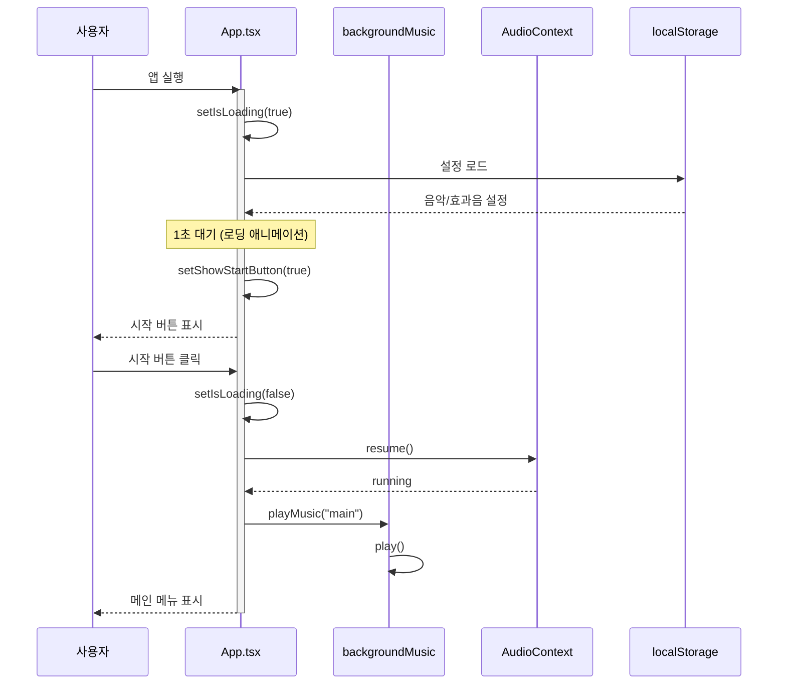
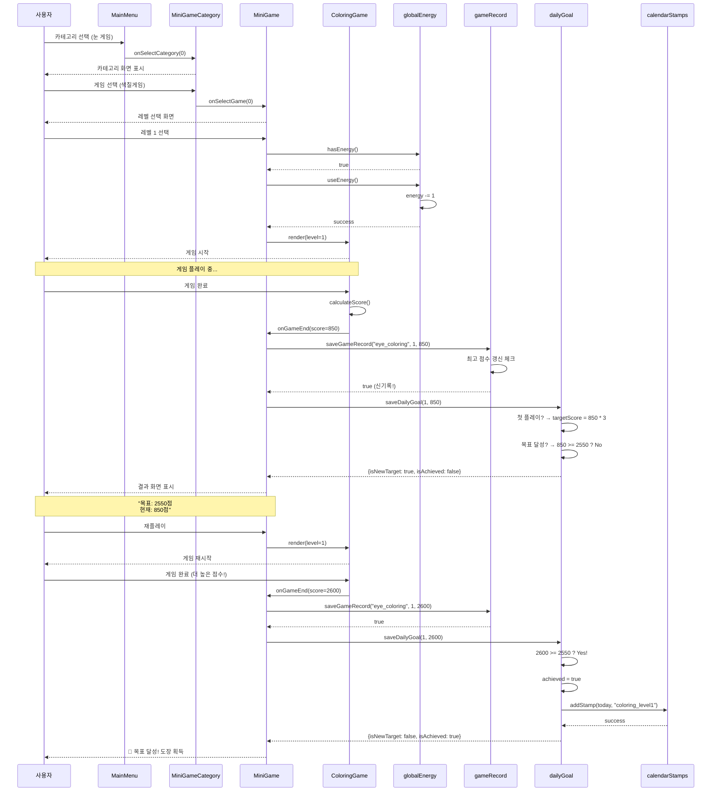
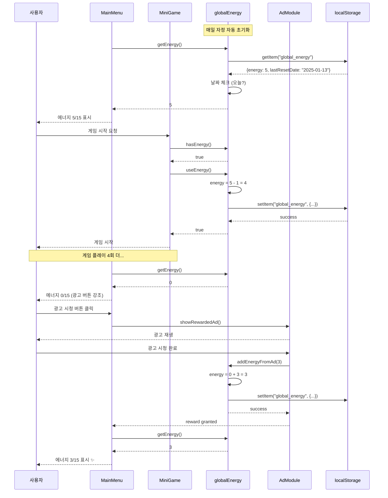
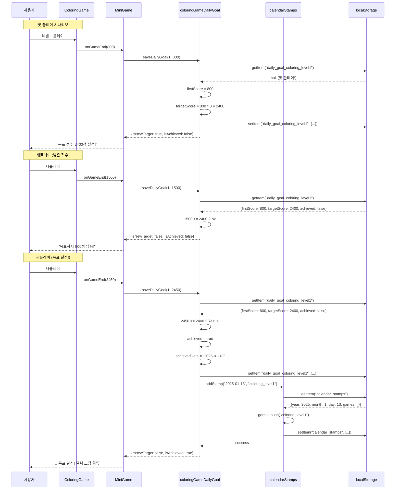
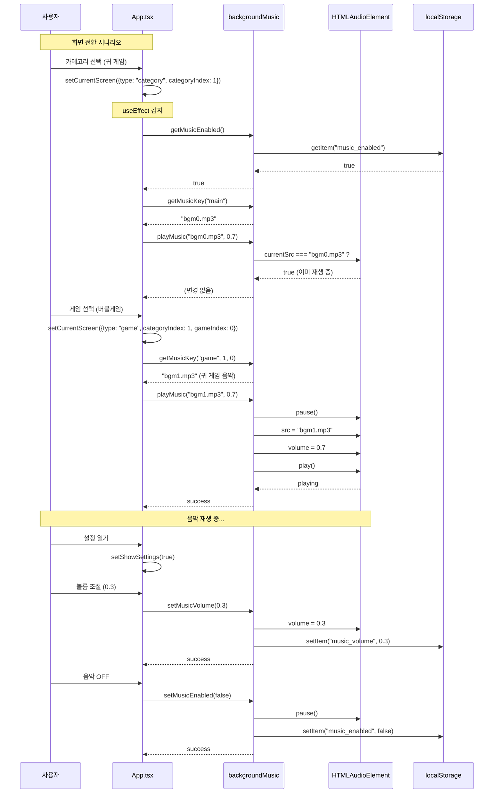
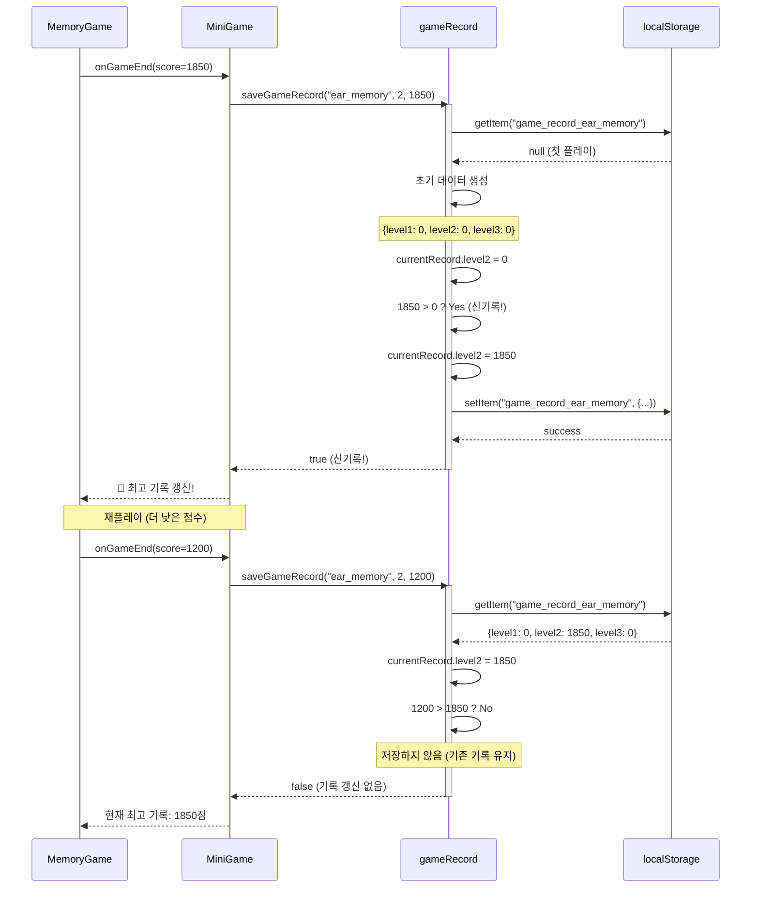
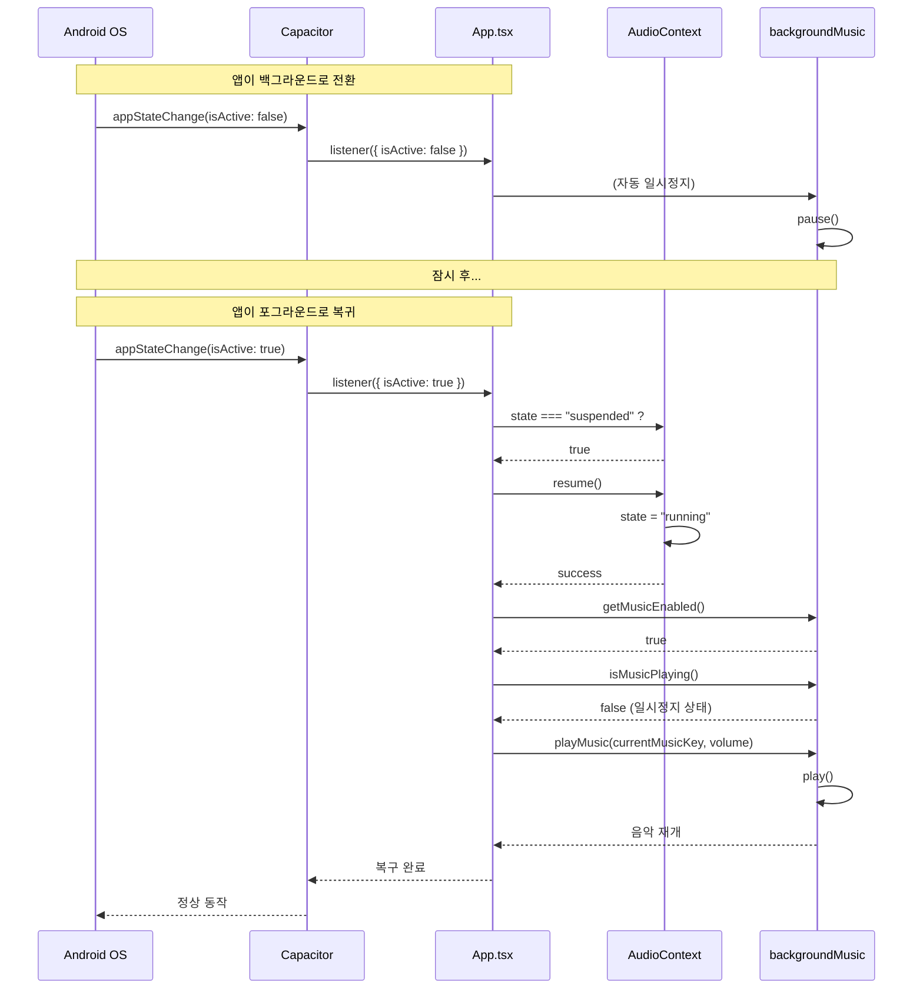

# 눈귀뇌 기능성 게임 시스템 설계 문서

## 📋 목차
1. [프로젝트 개요](#프로젝트-개요)
2. [기술 스택](#기술-스택)
3. [시스템 아키텍처](#시스템-아키텍처)
4. [모듈 설계](#모듈-설계)
5. [시퀀스 다이어그램](#시퀀스-다이어그램)
6. [게임 구조](#게임-구조)
7. [핵심 시스템](#핵심-시스템)
8. [데이터 관리](#데이터-관리)
9. [UI/UX 설계](#uiux-설계)
10. [사운드 시스템](#사운드-시스템)
11. [빌드 및 배포](#빌드-및-배포)
12. [파일 구조](#파일-구조)

---

## 🎮 프로젝트 개요

### 서비스 이름
**눈귀뇌하트** - 아동 인지 발달 미니게임 컬렉션

### 목적
4가지 카테고리(눈, 귀, 뇌, 하트)로 분류된 9개의 미니게임을 통해 아동의 시각, 청각, 인지, 정서 발달을 돕는 교육용 웹/앱 게임

### 타겟 사용자
- 주 사용자: 유아 및 초등 저학년 아동 (3~8세)
- 보조 사용자: 부모 및 교육자

### 주요 특징
- ✅ 스크롤 없는 전체 화면 UI (WebView 최적화)
- ✅ 하루 15회 플레이 제한 (에너지 시스템)
- ✅ 광고 시청으로 에너지 충전 (+3개)
- ✅ 달력 도장 시스템 (일일 목표 달성 추적)
- ✅ 목표 점수 통일 (첫 플레이 점수의 300%)
- ✅ Web Audio API 기반 효과음
- ✅ 한글 폰트 적용 (KkuBulLim, OngleipRyudung)
- ✅ Safe Area 대응 (노치/펀치홀 디바이스 지원)

---

## 🛠️ 기술 스택

### Frontend
- **React 18** - UI 프레임워크
- **TypeScript** - 타입 안정성
- **Tailwind CSS v4.0** - 스타일링
- **Motion (Framer Motion)** - 애니메이션
- **Lucide React** - 아이콘

### Audio
- **Web Audio API** - 효과음 재생
- **HTML5 Audio** - 배경음악

### Mobile
- **Capacitor** - 네이티브 앱 변환 (Android/iOS)
- **@capacitor/app** - 앱 라이프사이클 관리
- **@capacitor/browser** - 인앱 브라우저

### 게임 라이브러리
- **React DnD** - 드래그 앤 드롭
- **Canvas API** - 색칠 게임, 버블 슈터

### 데이터 저장
- **localStorage** - 게임 기록, 에너지, 설정 저장

---

## 🏗️ 시스템 아키텍처

### 컴포넌트 계층 구조

```
App.tsx (루트)
├── MainMenu (메인 메뉴)
│   ├── 에너지 표시
│   ├── 카테고리 버튼 x 4
│   └── 설정 버튼
│
├── MiniGameCategory (카테고리 선택)
│   └── 미니게임 버튼 x 3
│
├── MiniGame (게임 실행)
│   ├── ColoringGame (색칠게임)
│   ├── MemoryGame (카드게임)
│   ├── ClickInOrder (그림찾기)
│   ├── BubbleShooter (버블게임)
│   ├── DirectionGame (방향게임)
│   ├── ClassifyGame (분류게임)
│   ├── NumberGame (순서게임)
│   ├── YabawiGame (수학게임)
│   └── BombGame (퍼즐게임)
│
├── Settings (설정)
│   ├── 음악 볼륨 조절
│   ├── 효과음 ON/OFF
│   ├── 게임 음성 ON/OFF
│   └── 크레딧
│
├── Records (게임 기록)
│   ├── 달력 도장
│   └── 최고 점수 기록
│
└── HeadphoneGuide (헤드폰 가이드)
```

### 화면 흐름도

```
로딩 화면
    ↓
시작 버튼 (음악 시작)
    ↓
메인 메뉴 ←→ 설정
    ↓
카테고리 선택
    ↓
미니게임 선택
    ↓
게임 플레이 → 결과 화면
    ↓
메인 메뉴로 복귀
```

---

## 🎯 모듈 설계

### 1. 핵심 모듈 구조

#### 1.1 App Module (앱 루트)
**파일:** `/App.tsx`

**책임:**
- 전역 상태 관리 (화면 전환, 설정 모달)
- 앱 라이프사이클 관리 (Capacitor 연동)
- AudioContext 복구 및 음악 재생 제어
- 로딩 화면 및 시작 화면 처리

**주요 인터페이스:**
```typescript
type Screen =
  | { type: "main" }
  | { type: "category"; categoryIndex: number }
  | { type: "game"; categoryIndex: number; gameIndex: number }
  | { type: "records" };

interface AppState {
  currentScreen: Screen;
  showSettings: boolean;
  showHeadphoneGuide: boolean;
  isLoading: boolean;
  showStartButton: boolean;
}
```

**의존성:**
- `MainMenu`, `MiniGameCategory`, `MiniGame`, `Settings`, `Records`, `HeadphoneGuide`
- `backgroundMusic`, `sound` utils

---

#### 1.2 Energy Module (에너지 시스템)
**파일:** `/utils/globalEnergy.ts`

**책임:**
- 일일 에너지 관리 (15개 자동 충전)
- 에너지 소비 및 광고 충전 로직
- 날짜 변경 감지 및 자동 초기화

**주요 인터페이스:**
```typescript
interface EnergyData {
  energy: number;          // 0~15+
  lastResetDate: string;   // YYYY-MM-DD
}

// Public API
export const getEnergy = (): number
export const useEnergy = (): boolean
export const hasEnergy = (): boolean
export const addEnergyFromAd = (amount: number): void
export const resetEnergy = (): void
```

**데이터 흐름:**
```
localStorage ←→ EnergyData ←→ MainMenu (UI 표시)
                    ↓
            MiniGame (소비 체크)
                    ↓
            AdReward (충전)
```

---

#### 1.3 Game Record Module (게임 기록)
**파일:** `/utils/gameRecord.ts`

**책임:**
- 게임별/레벨별 최고 점수 저장
- 점수 갱신 로직 (최고 점수보다 높을 때만)
- 기록 조회 API 제공

**주요 인터페이스:**
```typescript
interface GameRecordData {
  level1: number;
  level2: number;
  level3: number;
}

// Public API
export const getGameRecord = (key: string): GameRecordData
export const saveGameRecord = (
  key: string,
  level: number,
  score: number
): boolean // true if new high score
```

**저장 키 규칙:**
- 형식: `game_record_{category}_{game}`
- 예: `game_record_eye_coloring`, `game_record_ear_bubble`

---

#### 1.4 Daily Goal Module (목표 점수 시스템)
**파일:** `/utils/[game]DailyGoal.ts` (9개 게임별)

**책임:**
- 첫 플레이 점수 기록 및 목표 점수 자동 설정 (× 3)
- 목표 달성 여부 추적
- 달력 도장 데이터 연동

**주요 인터페이스:**
```typescript
interface LevelGoalData {
  firstScore: number;
  targetScore: number;   // firstScore * 3
  achieved: boolean;
  achievedDate: string | null;
}

interface DailyGoalData {
  level1: LevelGoalData;
  level2: LevelGoalData;
  level3: LevelGoalData;
}

// Public API
export const getDailyGoal = (level: number): LevelGoalData
export const saveDailyGoal = (
  level: number,
  score: number
): { isNewTarget: boolean; isAchieved: boolean }
```

**로직 흐름:**
1. 첫 플레이: `firstScore` 저장 → `targetScore = firstScore * 3`
2. 재플레이: 점수가 `targetScore` 이상이면 `achieved = true`
3. 달성 시: 달력 도장 추가 (`calendarStamps` 업데이트)

---

#### 1.5 Sound Module (사운드 시스템)
**파일:** `/utils/sound.ts`, `/utils/backgroundMusic.ts`

##### 1.5.1 효과음 모듈 (`sound.ts`)
**책임:**
- Web Audio API 싱글톤 관리
- 효과음 재생 (클릭, 정답, 오답, 성공 등)
- 볼륨 조절 및 ON/OFF 제어

**주요 인터페이스:**
```typescript
// AudioContext 싱글톤
declare global {
  interface Window {
    sharedAudioContext?: AudioContext;
  }
}

// Public API
export const playClickSound = (): void
export const playCorrectSound = (): void
export const playIncorrectSound = (): void
export const playSuccessSound = (): void
export const playFailSound = (): void
export const playStartSound = (): void

export const getSoundEnabled = (): boolean
export const setSoundEnabled = (enabled: boolean): void
```

##### 1.5.2 배경음악 모듈 (`backgroundMusic.ts`)
**책임:**
- HTML5 Audio 인스턴스 관리
- 카테고리별 음악 전환
- 볼륨 페이드 인/아웃

**주요 인터페이스:**
```typescript
// Public API
export const playMusic = (musicKey: string, volume: number): void
export const pauseMusic = (): void
export const resumeMusic = (): void
export const setMusicVolume = (volume: number): void
export const getMusicEnabled = (): boolean
export const setMusicEnabled = (enabled: boolean): void
export const isMusicPlaying = (): boolean
```

**음악 키 매핑:**
```typescript
const MUSIC_MAP: Record<string, string> = {
  main: "/music/bgm0.mp3",
  category_0: "/music/bgm0.mp3",  // 눈
  category_1: "/music/bgm1.mp3",  // 귀
  category_2: "/music/bgm2.mp3",  // 뇌
};
```

---

#### 1.6 Game Component Module (게임 컴포넌트)
**파일:** `/components/games/*.tsx` (9개 게임)

**공통 Props 인터페이스:**
```typescript
interface GameProps {
  level: number;           // 1, 2, 3
  onGameEnd: (score: number) => void;
  onBack: () => void;
}
```

**공통 책임:**
- 게임 로직 실행
- 점수 계산
- 결과 화면 표시
- 효과음 재생

**게임별 특수 모듈:**

##### 색칠게임 모듈
**파일:** `/components/games/coloring/*`
```
/coloring
├── coloringData.ts      # 색상 팔레트 정의
├── coloringGroups.ts    # 그룹별 영역 매핑
├── coloringTypes.ts     # TypeScript 타입
├── scoringUtils.ts      # 점수 계산 알고리즘
└── useColoringCanvas.ts # Canvas 훅
```

**Canvas 훅 인터페이스:**
```typescript
interface UseColoringCanvasReturn {
  canvasRef: RefObject<HTMLCanvasElement>;
  selectedColor: string | null;
  setSelectedColor: (color: string | null) => void;
  handleCanvasClick: (e: MouseEvent) => void;
  getScore: () => number;
}
```

---

#### 1.7 UI Component Module
**파일:** `/components/*.tsx`

##### 1.7.1 MainMenu
**책임:**
- 카테고리 선택 버튼 표시
- 에너지 표시 및 광고 버튼
- 설정/기록 화면 진입

**Props:**
```typescript
interface MainMenuProps {
  onSelectCategory: (categoryIndex: number) => void;
  onOpenSettings: () => void;
  onOpenRecords: () => void;
}
```

##### 1.7.2 MiniGameCategory
**책임:**
- 카테고리 내 3개 게임 표시
- 각 게임의 달성률 표시
- 게임 선택 및 실행

**Props:**
```typescript
interface MiniGameCategoryProps {
  categoryIndex: number;
  onBack: () => void;
  onSelectGame: (gameIndex: number) => void;
}
```

##### 1.7.3 MiniGame (게임 컨테이너)
**책임:**
- 레벨 선택 화면 표시
- 게임 컴포넌트 렌더링
- 결과 처리 (점수 저장, 도장 추가)

**Props:**
```typescript
interface MiniGameProps {
  categoryIndex: number;
  gameIndex: number;
  onBack: () => void;
}
```

##### 1.7.4 Records (게임 기록)
**책임:**
- 달력 도장 표시
- 월별 페이지네이션
- 게임별 도장 아이콘 표시

**데이터 구조:**
```typescript
interface CalendarStamp {
  year: number;
  month: number;
  day: number;
  games: string[];  // ["coloring_level1", "memory_level2", ...]
}
```

##### 1.7.5 Settings
**책임:**
- 음악/효과음/음성 설정
- 볼륨 조절
- 크레딧 표시
- 마스터 리셋 (개발자 모드)

**설정 키:**
```typescript
const SETTINGS_KEYS = {
  MUSIC_ENABLED: "music_enabled",
  MUSIC_VOLUME: "music_volume",
  SOUND_ENABLED: "sound_enabled",
  VOICE_ENABLED: "voice_enabled",
};
```

---

### 2. 모듈 간 의존성 다이어그램

```
┌─────────────────────────────────────────┐
│           App.tsx (루트)                │
│  - 화면 전환 관리                        │
│  - 음악 재생 제어                        │
│  - Capacitor 연동                       │
└───────────┬─────────────────────────────┘
            │
    ┌───────┼───────┬───────────┬─────────┐
    │       │       │           │         │
    ▼       ▼       ▼           ▼         ▼
┌────────┐ ┌──────┐ ┌────────┐ ┌──────┐ ┌────────┐
│MainMenu│ │Cate- │ │MiniGame│ │Setti-│ │Records │
│        │ │gory  │ │        │ │ngs   │ │        │
└────┬───┘ └───┬──┘ └───┬────┘ └───┬──┘ └───┬────┘
     │         │        │          │        │
     │         │        │          │        │
     │         │    ┌───▼──────────▼────────▼───┐
     │         │    │   Game Components (9개)   │
     │         │    │ - ColoringGame             │
     │         │    │ - MemoryGame               │
     │         │    │ - BubbleShooter ...        │
     │         │    └───────────┬────────────────┘
     │         │                │
     ▼         ▼                ▼
┌────────────────────────────────────────┐
│         Utils Layer                    │
├────────────────────────────────────────┤
│ globalEnergy.ts      ◄──── 에너지 관리 │
│ gameRecord.ts        ◄──── 점수 저장   │
│ [game]DailyGoal.ts   ◄──── 목표 관리   │
│ backgroundMusic.ts   ◄──── 배경음악    │
│ sound.ts             ◄──── 효과음      │
└────────────┬───────────────────────────┘
             │
             ▼
    ┌────────────────┐
    │  localStorage  │
    └────────────────┘
```

---

### 3. 데이터 흐름 다이어그램

```
┌─────────────┐
│   사용자     │
└──────┬──────┘
       │ 게임 플레이
       ▼
┌──────────────────┐
│  MiniGame        │◄─── level 선택
│  (컨테이너)      │
└────┬─────────────┘
     │ 에너지 체크
     ▼
┌──────────────────┐
│ globalEnergy.ts  │
│  - useEnergy()   │◄──── localStorage
└────┬─────────────┘
     │ 성공
     ▼
┌──────────────────┐
│ ColoringGame     │
│ (게임 실행)      │
└────┬─────────────┘
     │ onGameEnd(score)
     ▼
┌──────────────────────────────┐
│ MiniGame (결과 처리)          │
│ 1. gameRecord.ts 저장         │
│ 2. [game]DailyGoal.ts 체크    │
│ 3. 목표 달성 시 도장 추가      │
└────┬─────────────────────────┘
     │
     ▼
┌──────────────────┐
│ localStorage     │
│ - game_record_*  │
│ - daily_goal_*   │
│ - calendar_*     │
└──────────────────┘
```

---

## 🎯 시퀀스 다이어그램

### 1. 앱 시작 플로우



---

### 2. 게임 플레이 플로우



---

### 3. 에너지 시스템 플로우



---

### 4. 목표 점수 달성 플로우



---

### 5. 배경음악 시스템 플로우



---

### 6. 게임 기록 저장 플로우



---

### 7. Capacitor 앱 라이프사이클 플로우



---

## 🎯 게임 구조

### 카테고리 및 게임 목록

| 카테고리 | 게임 1 | 게임 2 | 게임 3 |
|---------|--------|--------|--------|
| 👁️ 눈 게임 | 색칠게임 | 카드게임 | 그림찾기 |
| 👂 귀 게임 | 버블게임 | 방향게임 | 분류게임 |
| 🧠 뇌 게임 | 순서게임 | 수학게임 | 퍼즐게임 |
| ❤️ 하트 | (게임 기록 화면) | - | - |

### 게임별 세부 정보

#### 1. 색칠게임 (ColoringGame)
- **목표**: 음성으로 들려주는 색상으로 그림 영역 색칠
- **난이도**: 3단계 (2색상 → 3색상 → 4색상)
- **점수 계산**: 정확도 기반 (색상 매칭률)
- **특징**: Canvas 기반, 터치/마우스 지원

#### 2. 카드게임 (MemoryGame)
- **목표**: 같은 그림 찾기 (메모리 매칭)
- **난이도**: 3단계 (4쌍 → 6쌍 → 8쌍)
- **점수 계산**: 남은 시간 + 시도 횟수
- **특징**: 뒤집기 애니메이션, 자동 매칭 확인

#### 3. 그림찾기 (ClickInOrder)
- **목표**: 음성으로 들려주는 순서대로 그림 클릭
- **난이도**: 3단계 (3개 → 4개 → 5개)
- **점수 계산**: 정확도 + 남은 시간
- **특징**: 동적 이미지 배치, 랜덤 위치

#### 4. 버블게임 (BubbleShooter)
- **목표**: 음성으로 들려주는 색상의 버블 슈팅
- **난이도**: 3단계 (3색 → 4색 → 5색)
- **점수 계산**: 정확도 + 속도
- **특징**: Canvas 기반 물리 엔진, 충돌 감지

#### 5. 방향게임 (DirectionGame)
- **목표**: 음성으로 들려주는 방향 화살표 클릭
- **난이도**: 3단계 (4방향 → 8방향 → 혼합)
- **점수 계산**: 정확도 + 반응 속도
- **특징**: 랜덤 배치, 타이머

#### 6. 분류게임 (ClassifyGame)
- **목표**: 음성으로 들려주는 조건에 맞는 아이템 분류
- **난이도**: 3단계 (색상 → 모양 → 복합)
- **점수 계산**: 정확도
- **특징**: 드래그 앤 드롭

#### 7. 순서게임 (NumberGame)
- **목표**: 숫자/문자 순서대로 클릭
- **난이도**: 3단계 (1~5 → 1~8 → 1~10)
- **점수 계산**: 정확도 + 속도
- **특징**: 랜덤 배치, 진행률 표시

#### 8. 수학게임 (YabawiGame)
- **목표**: 컵 아래 숨은 공 찾기 (야바위)
- **난이도**: 3단계 (3컵 → 4컵 → 5컵)
- **점수 계산**: 정확도
- **특징**: 셔플 애니메이션

#### 9. 퍼즐게임 (BombGame)
- **목표**: 폭탄 아닌 타일 클릭하여 모두 열기
- **난이도**: 3단계 (6타일 → 9타일 → 12타일)
- **점수 계산**: 생명 + 속도
- **특징**: 랜덤 배치, 생명 시스템

---

## 💾 데이터 관리

### localStorage 키 목록

| 키 이름 | 데이터 타입 | 설명 |
|---------|------------|------|
| `global_energy` | `EnergyData` | 전역 에너지 상태 |
| `game_record_{category}_{game}` | `GameRecordData` | 게임별 최고 점수 |
| `daily_goal_{game}_level{n}` | `DailyGoalData` | 게임별 목표 점수 |
| `calendar_stamps` | `CalendarStamp[]` | 달력 도장 데이터 |
| `music_enabled` | `boolean` | 배경음악 ON/OFF |
| `music_volume` | `number` | 음악 볼륨 (0.0~1.0) |
| `sound_enabled` | `boolean` | 효과음 ON/OFF |
| `voice_enabled` | `boolean` | 게임 음성 ON/OFF |
| `headphone_guide_shown` | `boolean` | 헤드폰 가이드 표시 여부 |

### 데이터 초기화 (개발자 모드)

메인 화면 제목 "눈귀뇌하트" 5회 연속 클릭 시:
- 마스터 리셋 버튼 표시
- 모든 localStorage 데이터 삭제
- 에너지 15개 복구

---

## 🎨 UI/UX 설계

### 디자인 시스템

**색상 팔레트:**
- 배경: `bg-amber-50` (#fffbeb)
- 주요 텍스트: `#4a4a4a`
- 버튼: 게임별 테마 색상
- 달성: 초록색 계열
- 미달성: 회색 계열

**타이포그래피:**
- 제목: `KkuBulLim` (꾸불림체) - 메인 타이틀
- 본문: `OngleipRyudung` (옹글입류똥체) - UI 텍스트
- 크기: 반응형 (16px → 20px → 24px)

**반응형 디자인:**
```css
/* 기본 (모바일) */
html { font-size: 16px; }

/* 태블릿 (620px+ & 1024px+) */
@media (min-width: 620px) and (min-height: 1024px) {
  html { font-size: 20px; }
}

/* 데스크탑 (750px+ & 1280px+) */
@media (min-width: 750px) and (min-height: 1280px) {
  html { font-size: 24px; }
}
```

### Safe Area 대응

**노치/펀치홀 대응:**
```css
/* 메인 화면 */
pt-[max(env(safe-area-inset-top), 4rem)]

/* 게임/광고 화면 */
pt-[max(env(safe-area-inset-top), 3rem)]
```

**효과:**
- 웹: 각각 16px 여백 감소 → 화면 활용도 증가
- 모바일: 안전 영역만큼 자동 여백 설정

### 전체 화면 고정

```css
/* WebView 최적화 */
.h-screen {
  height: 100vh;
  overflow: hidden;
}

/* position: fixed 활용 */
position: fixed;
top: 0;
left: 0;
right: 0;
bottom: 0;
```

### 드래그 방지

```css
/* 사용자 선택 비활성화 */
user-select: none;
-webkit-user-select: none;
-webkit-touch-callout: none;

/* 이미지 드래그 방지 */
img {
  -webkit-user-drag: none;
  pointer-events: auto;
}
```

---

## 🔊 사운드 시스템

### 배경음악 (`/utils/backgroundMusic.ts`)

**기술 스택:**
- HTML5 Audio API
- 싱글톤 오디오 인스턴스

**주요 기능:**
```typescript
// 음악 재생
playMusic(categoryIndex: number, musicVolume: number)

// 일시정지/재개
pauseMusic()
resumeMusic()

// 볼륨 조절 (0.0 ~ 1.0)
setMusicVolume(volume: number)

// 상태 확인
getMusicEnabled(): boolean
isMusicPlaying(): boolean
```

**음악 파일 매핑:**
- 카테고리 0 (눈): `bgm0.mp3`
- 카테고리 1 (귀): `bgm1.mp3`
- 카테고리 2 (뇌): `bgm2.mp3`

### 효과음 (`/utils/sound.ts`)

**Web Audio API 사용:**
```typescript
// AudioContext 공유 (메모리 효율)
window.sharedAudioContext = new AudioContext()

// 효과음 종류
playClickSound()      // 버튼 클릭
playSelectSound()     // 선택
playCorrectSound()    // 정답
playIncorrectSound()  // 오답
playSuccessSound()    // 성공
playFailSound()       // 실패
playStartSound()      // 시작
```

**특징:**
- 중복 재생 방지
- 볼륨 조절 가능
- 모바일 자동 재생 제약 대응

### 게임 음성 (`/utils/colorVoice.ts`)

**TTS 또는 녹음 파일:**
```typescript
// 색상 음성 재생
playColorVoice(color: string, voiceEnabled: boolean)

// 예: "빨강", "파랑", "노랑" 등
```

---

## 📦 빌드 및 배포

### 웹 빌드

```bash
# 개발 서버
npm run dev

# 프로덕션 빌드
npm run build

# 빌드 결과물: /dist
```

### Capacitor Android 빌드

#### 1. 프로젝트 초기 설정

```bash
# Capacitor 설치
npm install @capacitor/core @capacitor/cli

# Capacitor 초기화
npx cap init

# 앱 정보 입력
App name: 눈귀뇌하트
App ID: com.eyeearbrainheart.game (역도메인 형식)
```

#### 2. 웹 빌드 & 동기화

```bash
# 웹 앱 빌드
npm run build

# Android 플랫폼 추가 (최초 1회)
npx cap add android

# 웹 빌드 결과물을 네이티브 프로젝트로 동기화
npx cap sync android
```

#### 3. Capacitor 설정 (`capacitor.config.ts`)

```typescript
import { CapacitorConfig } from '@capacitor/cli';

const config: CapacitorConfig = {
  appId: 'com.eyeearbrainheart.game',
  appName: '눈귀뇌하트',
  webDir: 'dist',
  server: {
    androidScheme: 'https',
    // 개발 시 로컬 서버 사용 (선택)
    // url: 'http://192.168.0.100:5173',
    // cleartext: true
  },
  android: {
    allowMixedContent: true
  }
};

export default config;
```

#### 4. AndroidManifest.xml 설정

**파일 위치:** `android/app/src/main/AndroidManifest.xml`

```xml
<manifest>
  <application
    android:usesCleartextTraffic="true"
    android:hardwareAccelerated="true">
    
    <activity
      android:configChanges="orientation|keyboardHidden|keyboard|screenSize|locale|smallestScreenSize|screenLayout|uiMode"
      android:launchMode="singleTask"
      android:windowSoftInputMode="adjustResize"
      android:theme="@style/AppTheme.NoActionBarLaunch">
      
      <!-- Safe Area 지원 -->
      <meta-data
        android:name="android.support.PARENT_ACTIVITY"
        android:value=".MainActivity" />
    </activity>
  </application>

  <!-- 권한 -->
  <uses-permission android:name="android.permission.INTERNET" />
  <uses-permission android:name="android.permission.ACCESS_NETWORK_STATE" />
</manifest>
```

#### 5. Safe Area 설정

**파일:** `android/app/src/main/res/values/styles.xml`

```xml
<resources>
  <style name="AppTheme.NoActionBarLaunch" parent="Theme.AppCompat.NoActionBar">
    <item name="android:background">@null</item>
    <item name="android:windowLayoutInDisplayCutoutMode">shortEdges</item>
  </style>
</resources>
```

#### 6. Android Studio에서 빌드

```bash
# Android Studio 실행
npx cap open android

# Android Studio에서:
# 1. Build > Generate Signed Bundle / APK
# 2. APK 선택
# 3. 키스토어 생성 또는 선택
# 4. Release 빌드
# 5. app-release.apk 생성
```

#### 7. 빌드 자동화 (선택)

**package.json 스크립트 추가:**
```json
{
  "scripts": {
    "build:web": "vite build",
    "build:android": "npm run build:web && npx cap sync android",
    "open:android": "npx cap open android"
  }
}
```

**사용:**
```bash
# 웹 빌드 + Android 동기화
npm run build:android

# Android Studio 실행
npm run open:android
```

#### 8. APK 설치 및 테스트

```bash
# USB 디버깅으로 기기 연결 후
adb install app/build/outputs/apk/release/app-release.apk

# 또는 Android Studio에서 직접 Run
```

#### 9. 플레이스토어 배포 준비

```bash
# AAB 번들 생성 (권장)
# Android Studio:
# Build > Generate Signed Bundle / APK > Android App Bundle

# 결과물: app-release.aab
# Google Play Console에 업로드
```

---

## 📁 파일 구조

```
/
├── App.tsx                          # 루트 컴포넌트
├── capacitor.config.ts              # Capacitor 설정
│
├── /components
│   ├── MainMenu.tsx                 # 메인 메뉴
│   ├── MiniGameCategory.tsx         # 카테고리 선택
│   ├── MiniGame.tsx                 # 게임 컨테이너
│   ├── Settings.tsx                 # 설정 화면
│   ├── Records.tsx                  # 게임 기록
│   ├── HeadphoneGuide.tsx           # 헤드폰 가이드
│   ├── GameRulesModal.tsx           # 게임 규칙 모달
│   ├── GameRulesButton.tsx          # 물음표 버튼
│   │
│   ├── /games                       # 9개 미니게임
│   │   ├── ColoringGame.tsx         # 색칠게임
│   │   ├── MemoryGame.tsx           # 카드게임
│   │   ├── ClickInOrder.tsx         # 그림찾기
│   │   ├── BubbleShooter.tsx        # 버블게임
│   │   ├── DirectionGame.tsx        # 방향게임
│   │   ├── ClassifyGame.tsx         # 분류게임
│   │   ├── NumberGame.tsx           # 순서게임
│   │   ├── YabawiGame.tsx           # 수학게임
│   │   ├── BombGame.tsx             # 퍼즐게임
│   │   ├── LevelButton.tsx          # 레벨 버튼 (일반)
│   │   ├── LevelButtonWithChances.tsx # 레벨 버튼 (기회제)
│   │   │
│   │   └── /coloring                # 색칠게임 모듈
│   │       ├── coloringData.ts      # 색상 데이터
│   │       ├── coloringGroups.ts    # 그룹 정의
│   │       ├── coloringTypes.ts     # 타입 정의
│   │       ├── scoringUtils.ts      # 점수 계산
│   │       └── useColoringCanvas.ts # Canvas 훅
│   │
│   ├── /ui                          # shadcn/ui 컴포넌트
│   │   ├── button.tsx
│   │   ├── dialog.tsx
│   │   ├── slider.tsx
│   │   └── ...
│   │
│   └── /figma
│       └── ImageWithFallback.tsx    # 이미지 폴백 컴포넌트
│
├── /utils
│   ├── globalEnergy.ts              # 전역 에너지 시스템
│   ├── gameRecord.ts                # 게임 기록 저장
│   ├── backgroundMusic.ts           # 배경음악 제어
│   ├── sound.ts                     # 효과음 시스템
│   ├── colorVoice.ts                # 색상 음성
│   │
│   └── /[게임별]DailyGoal.ts        # 게임별 목표 점수 관리
│       ├── coloringGameDailyGoal.ts
│       ├── memoryGameDailyGoal.ts
│       ├── clickInOrderDailyGoal.ts
│       ├── bubbleShooterDailyGoal.ts
│       ├── directionGameDailyGoal.ts
│       ├── classifyGameDailyGoal.ts
│       ├── numberGameDailyGoal.ts
│       ├── yabawiGameDailyGoal.ts
│       └── bombGameDailyGoal.ts
│
├── /styles
│   └── globals.css                  # 전역 스타일 (폰트, 애니메이션)
│
├── /imports                         # Figma 에셋
│   ├── Child.tsx                    # 캐릭터 SVG
│   ├── House.tsx
│   ├── Balloons.tsx
│   └── ...
│
├── /docs
│   └── TTS_IMPLEMENTATION_GUIDE.md  # TTS 가이드
│
├── /android                         # Capacitor Android 프로젝트
│   ├── app/
│   ├── build.gradle
│   └── ...
│
├── SYSTEM_DESIGN.md                 # 📄 이 문서
├── CHANGELOG.md                     # 변경 이력
├── ASSETS_GUIDE.md                  # 에셋 가이드
└── MUSIC_GUIDE.md                   # 음악 가이드
```

---

## 🔧 개발 가이드

### 새 게임 추가 방법

1. **게임 컴포넌트 생성** (`/components/games/NewGame.tsx`)
   ```tsx
   interface NewGameProps {
     level: number;
     onGameEnd: (score: number) => void;
     onBack: () => void;
   }
   
   export function NewGame({ level, onGameEnd, onBack }: NewGameProps) {
     // 게임 로직
   }
   ```

2. **목표 점수 유틸 생성** (`/utils/newGameDailyGoal.ts`)
   ```typescript
   export const getNewGameDailyGoal = (level: number) => { ... }
   export const saveNewGameDailyGoal = (level: number, score: number) => { ... }
   ```

3. **MiniGame.tsx에 추가**
   ```tsx
   import { NewGame } from "./games/NewGame";
   
   const gameComponents = [
     // ...
     [NewGame],
   ];
   ```

4. **메인 메뉴 이미지 추가**
   ```tsx
   import newGameImage from "figma:asset/[hash].png";
   ```

### 디버깅 팁

**개발자 모드 활성화:**
- 메인 화면 제목 "눈귀뇌하트" 5회 클릭
- 마스터 리셋 버튼 표시
- 개발자 도구 아이콘(🔧) 클릭으로 비활성화

**localStorage 확인:**
```javascript
// 브라우저 콘솔에서
localStorage.getItem('global_energy')
localStorage.getItem('game_record_eye_coloring')
```

**AudioContext 상태 확인:**
```javascript
window.sharedAudioContext.state  // "running" or "suspended"
```

---

## 🚀 성능 최적화

### 이미지 최적화
- Figma Asset: `figma:asset/[hash].png` 스킴 사용
- WebP 포맷 권장
- 적절한 해상도 (모바일 2x, 태블릿 3x)

### Canvas 최적화
- `requestAnimationFrame` 사용
- 불필요한 리렌더링 방지
- 오프스크린 캔버스 활용

### 메모리 관리
- AudioContext 싱글톤 패턴
- 게임 종료 시 리소스 정리
- localStorage 정기 정리

---

## 🔐 보안 고려사항

### localStorage 보안
- 민감 정보 저장 금지
- 게임 기록만 저장 (개인정보 없음)

### 광고 시스템
- 외부 광고 SDK 연동 시 개인정보 처리방침 준수
- COPPA(아동 온라인 개인정보 보호법) 준수

---

## 📱 모바일 최적화

### 터치 이벤트
- `touchstart`, `touchend` 지원
- 300ms 탭 지연 제거
- 드래그 제스처 최적화

### 성능
- GPU 가속 활성화 (`transform: translateZ(0)`)
- 60fps 목표
- 배터리 효율 고려

### WebView 설정
```typescript
// capacitor.config.ts
{
  server: {
    androidScheme: 'https',
    iosScheme: 'capacitor'
  },
  android: {
    allowMixedContent: true,
    backgroundColor: '#fffbeb'
  }
}
```

---

## 🐛 알려진 이슈 및 해결

### 1. iOS에서 AudioContext 자동 재생 차단
**해결:** 시작 버튼 클릭 시 `audioContext.resume()` 호출

### 2. Safe Area 미적용
**해결:** `viewport-fit=cover` 메타태그 추가
```html
<meta name="viewport" content="width=device-width, initial-scale=1.0, viewport-fit=cover">
```

### 3. localStorage 용량 제한
**해결:** 최대 5MB 제한 준수, 불필요한 데이터 정리

---

## 📈 향후 개선 사항

### 단기 (1~2개월)
- [ ] 서버 연동 (순위 시스템)
- [ ] 친구 초대 기능
- [ ] 추가 테마/스킨
- [ ] 튜토리얼 개선

### 중기 (3~6개월)
- [ ] 멀티플레이 모드
- [ ] 부모 대시보드
- [ ] AI 난이도 조절
- [ ] 보상 시스템 확장

### 장기 (6개월+)
- [ ] iOS 앱 출시
- [ ] 다국어 지원 (영어, 중국어)
- [ ] 클라우드 저장
- [ ] AR/VR 게임 추가

---

## 📞 문의 및 지원

### 개발팀
- 프로젝트명: 눈귀뇌하트
- 플랫폼: Web, Android (iOS 예정)

### 기술 스택 문의
- React/TypeScript
- Capacitor
- Web Audio API
- Canvas API

---

## 📄 라이선스

이 프로젝트는 교육용 목적으로 개발되었습니다.

**사용 에셋:**
- 폰트: 눈누 프로젝트 (오픈소스)
- 이미지: Figma 디자인 (자체 제작)
- 음악: 저작권 프리 음원

**상세 라이선스:** `Attributions.md` 참조

---

## 🎓 참고 자료

### 공식 문서
- [React 공식 문서](https://react.dev)
- [Capacitor 공식 문서](https://capacitorjs.com/docs)
- [Web Audio API](https://developer.mozilla.org/en-US/docs/Web/API/Web_Audio_API)
- [Canvas API](https://developer.mozilla.org/en-US/docs/Web/API/Canvas_API)

### 프로젝트 문서
- [TTS 구현 가이드](/docs/TTS_IMPLEMENTATION_GUIDE.md)
- [에셋 가이드](/ASSETS_GUIDE.md)
- [음악 가이드](/MUSIC_GUIDE.md)
- [변경 이력](/CHANGELOG.md)

---

**최종 수정일:** 2025-01-13  
**문서 버전:** 1.0.0  
**작성자:** 눈귀뇌하트 개발팀
